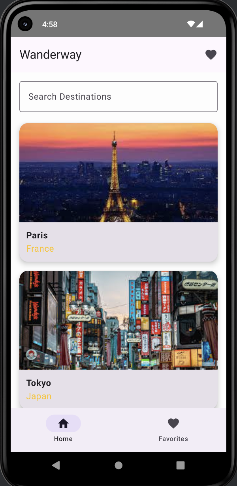
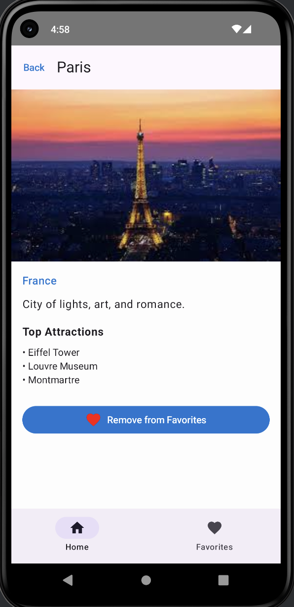
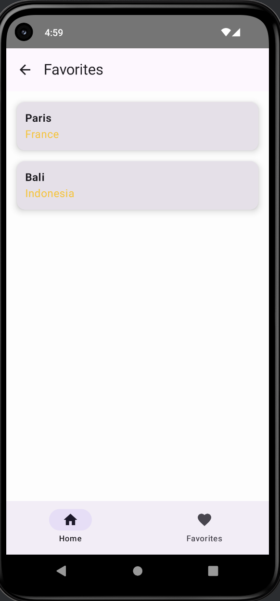
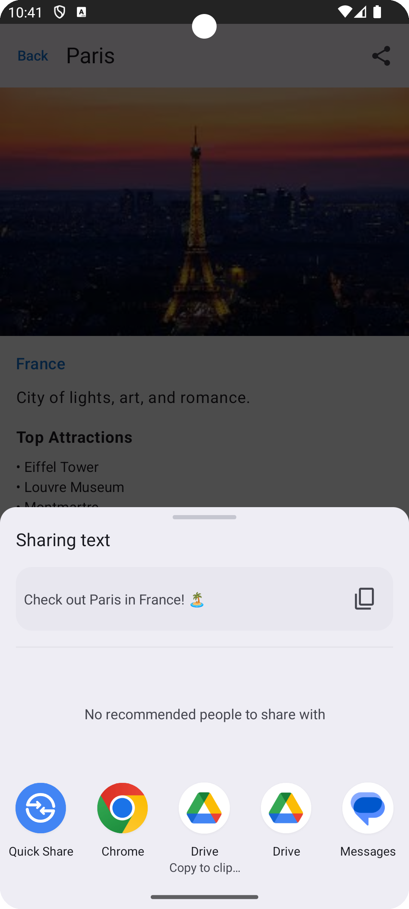
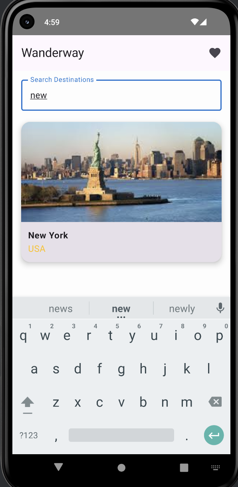
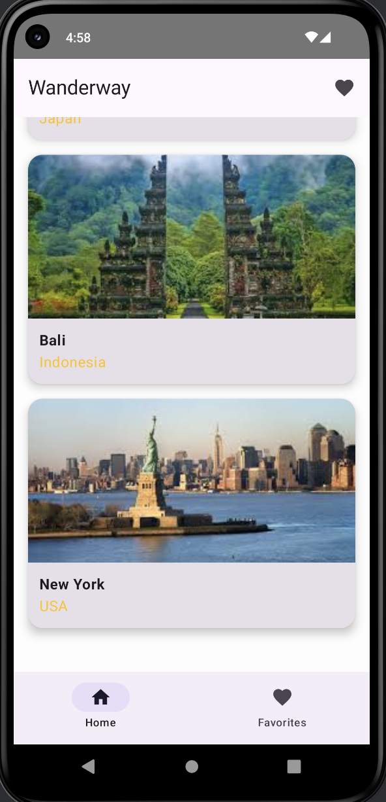

# 🌍 WanderWay - Travel Guide App

### CPSC 411A-02 – Midterm Project (Fall 2025)

A modern **Jetpack Compose Android application** that helps users explore world destinations, view detailed information, and save their favorite places.  
Built with **Kotlin**, **MVVM architecture**, and **Jetpack Compose**, it provides a smooth, declarative, and responsive UI experience.

---

## Features  

| Category | Description |
|-----------|-------------|
| **Home Screen** | Browse beautiful world destinations with high-quality images and live search filtering. |
| **Details Screen** | View destination information, top attractions, and an animated️ “Add to Favorites” button. |
| **Favorites Screen** | Manage and revisit saved travel destinations in a fully scrollable list. |
| **Search Bar** | Instantly filter destinations by name or country. |
| **Bottom Navigation** | Seamlessly switch between Home and Favorites. |
| **State Management** | ViewModel + Compose State handle all favorite toggles and data dynamically. |
| **Material 3 Design** | Clean, modern interface following Android’s latest design system. |
| **Smooth Navigation** | Uses `NavHost` for structured screen transitions. |

---

## Tech Stack  

| Component | Technology |
|------------|-------------|
| **Language** | Kotlin |
| **UI Framework** | Jetpack Compose |
| **Architecture** | MVVM (Model – View – ViewModel) |
| **Design System** | Material 3 |
| **Navigation** | `androidx.navigation.compose` |
| **State Handling** | `mutableStateListOf`, `remember`, `ViewModel` |
| **IDE** | Android Studio Ladybug / Koala |
| **Build Tool** | Gradle 8.7 |

---

## Getting Started  

### 1️⃣ Clone the Repository  
```bash
git clone https://github.com/IndrayaniBhosale/WanderWay.git
cd WanderWay
````

### 2️⃣ Open in Android Studio

* Go to **File → Open → WanderWay**
* Allow Gradle to sync automatically

### 3️⃣ Build & Run

* Click **▶ Run** on the toolbar
* Select an emulator (e.g., *Pixel 5 API 33*)
* The app launches on the **Home Screen** with destination cards ready to explore

---

## Screenshots

### Home Screen



### Details Screen



### Favorites Screen



### Share Screen



### Search Demo



### Bottom Navigation



---

## Future Enhancements

* Integrate real travel APIs (Google Places / TripAdvisor)
* Add **Room Database** or **DataStore** for persistent favorites
* Add **Splash / Intro Animations**
* Include “Plan My Trip” or “Share Destination” features

---

## Authors

| Name                            | CWID      | Email                                                                               |
| ------------------------------- | --------- | ----------------------------------------------------------------------------------- |
| **Indrayani Vijaysinh Bhosale** | 842614851 | [indrayanibhosale75@csu.fullerton.edu](mailto:indrayanibhosale75@csu.fullerton.edu) |
| **Janya Jaiswal**               | 878062934 | [janyaj@csu.fullerton.edu](mailto:janyaj@csu.fullerton.edu)                         |
| **Shrutik Kupekar**             | 884426727 | [shrutikkupekar@csu.fullerton.edu](mailto:shrutikkupekar@csu.fullerton.edu)         |
| **Suyash Jadhav**               | 880760830 | [suyash1jadhav@csu.fullerton.edu](mailto:suyash1jadhav@csu.fullerton.edu)           |

